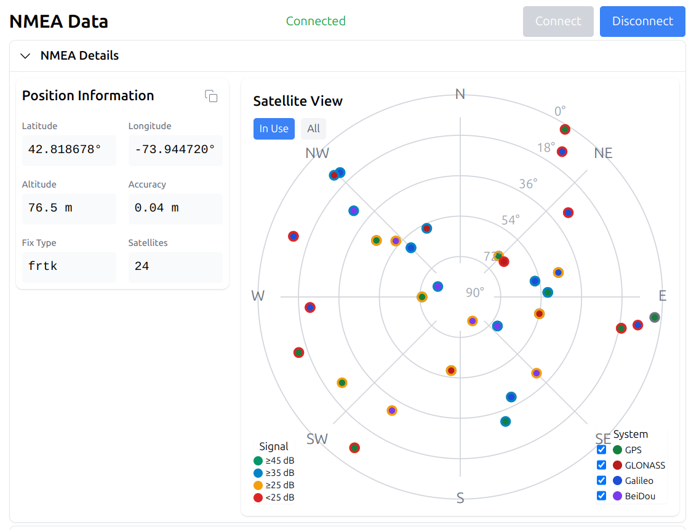

# NMEA Widgets



A modern React/Preact component library for visualizing NMEA GPS data in real-time using the Web Serial API. Built with TypeScript and Tailwind CSS.

[Try the nmea-demo!](https://jbroll.github.io/nmea-widgets/)

<br clear="all">

## Features

- Real-time NMEA sentence parsing and visualization
- Interactive satellite constellation view showing:
  - GPS, GLONASS, Galileo, and BeiDou satellites
  - Signal strength indicators
  - Elevation and azimuth display
  - Satellite status (in use/visible)
- Position information display with:
  - Latitude/Longitude coordinates
  - Altitude
  - Position accuracy (when GST messages available)
  - Fix type and satellite count
- Raw NMEA data view with filtering options
- Processed data inspection panel
- Responsive design that works on desktop and mobile browsers

## Installation

```bash
npm install @jbroll/nmea-widgets
```

This package has peer dependencies that you'll need to install in your project:

```bash
npm install preact tailwindcss
```

## Setup

1. Configure Tailwind CSS in your project. Add the NMEA Widgets content paths to your `tailwind.config.js`:

```js
/** @type {import('tailwindcss').Config} */
export default {
  content: [
    "./index.html",
    "./src/**/*.{js,ts,jsx,tsx}",
    "./node_modules/@jbroll/nmea-widgets/**/*.{js,ts,jsx,tsx}"
  ],
  theme: {
    extend: {},
  },
  plugins: [],
}
```

2. Import and initialize Tailwind CSS in your application:

```css
/* styles.css */
@tailwind base;
@tailwind components;
@tailwind utilities;
```

## Basic Usage

```tsx
import { NMEADisplay, useNMEA } from '@jbroll/nmea-widgets';

function App() {
  const { 
    serialData,
    processedData,
    isConnected,
    connect,
    disconnect,
    setFilter,
    isSupported
  } = useNMEA();

  return (
    <NMEADisplay
      serialData={serialData}
      processedData={processedData}
      onConnect={connect}
      onDisconnect={disconnect}
      onFilterChange={setFilter}
      isConnected={isConnected}
      isSupported={isSupported}
    />
  );
}
```

## Components

### NMEADisplay

The main component that provides a complete UI for NMEA data visualization.

```tsx
import { NMEADisplay } from '@jbroll/nmea-widgets';

<NMEADisplay
  serialData={string}
  processedData={ProcessedData}
  onConnect={() => void}
  onDisconnect={() => void}
  onFilterChange={(sentenceType: string, enabled: boolean) => void}
  isConnected={boolean}
  isSupported={boolean}
/>
```

### SatellitePlot

A standalone component for visualizing satellite positions and signal strengths.

```tsx
import { SatellitePlot } from '@jbroll/nmea-widgets';

<SatellitePlot data={processedData} />
```

### NMEAInfo

Displays position information and accuracy metrics.

```tsx
import { NMEAInfo } from '@jbroll/nmea-widgets';

<NMEAInfo data={processedData} />
```

### useNMEA Hook

A React hook that handles Web Serial communication and NMEA data processing.

```tsx
const {
  serialData,        // Raw NMEA sentences
  processedData,     // Parsed and processed NMEA data
  isConnected,       // Connection state
  isConnecting,      // Connection in progress
  error,             // Error state
  connect,           // Function to initiate connection
  disconnect,        // Function to close connection
  sendCommand,       // Function to send commands to device
  setFilter,         // Function to filter NMEA sentences
  isSupported        // Whether Web Serial API is supported
} = useNMEA();
```

## Types

### ProcessedData

```typescript
interface ProcessedData {
  position: {
    latitude: number;
    longitude: number;
    altitudeMeters: number;
    fixType: number;
    satellites: number;
  } | null;
  errorStats: {
    latitudeError: number;
    longitudeError: number;
    altitudeError: number;
  } | null;
  satellites: {
    visible: Satellite[];
    inUse: number[];
  };
}

interface Satellite {
  prnNumber: number;
  elevationDegrees: number;
  azimuthTrue: number;
  SNRdB: number;
  constellation: string;
}
```

## Browser Support

The Web Serial API is required for this library to function. Currently supported in:
- Google Chrome (desktop)
- Microsoft Edge (desktop)
- Opera (desktop)
- Chrome for Android (with flag)

## Contributing

Contributions are welcome! Please feel free to submit a Pull Request.

## License

MIT License - see LICENSE file for details

## Acknowledgments

- Uses [nmea-simple](https://github.com/jbroll/nmea-simple) for NMEA sentence parsing
- Interface design inspired by modern GPS visualization tools
